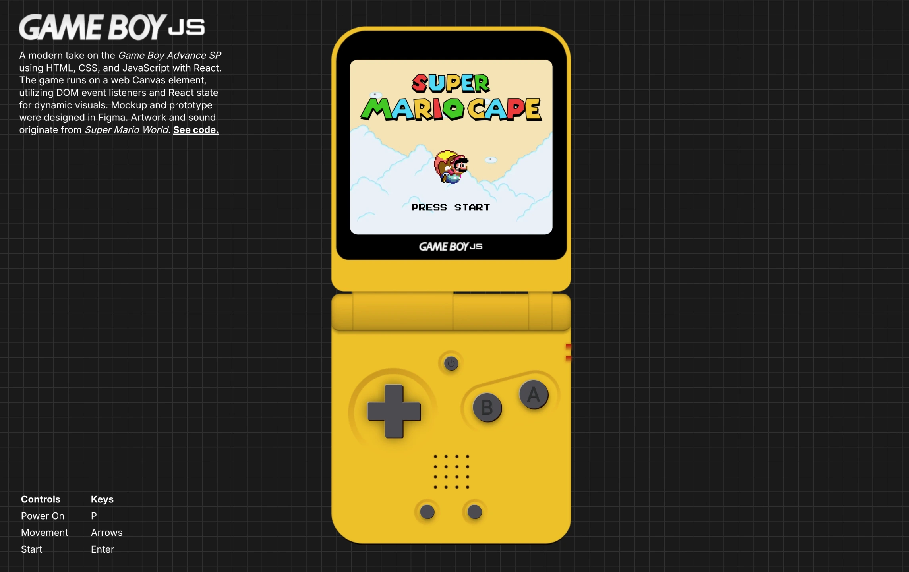

# Game Boy JS

<a href="https://gameboy-js-olive.vercel.app/" target="_blank"><b>[[ VIEW DEMO ]]</a>

_Playable on desktop and mobile!_

A retro-inspired Game Boy emulator and game demo built with modern front-end technologies. This project showcases my skills in UI/UX design, React development, and interactive web experiences.

## Project Overview

Game Boy JS is a web-based game and emulator interface, designed to evoke nostalgia while demonstrating advanced front-end engineering and design principles. The project features custom UI components, pixel-perfect layouts, and smooth game interactions. The game is based on Super Mario World.

## Features

- **Custom UI Components:** Modular React components for buttons, panels, HUD, and game canvas.
- **Responsive Design:** Adapts to various screen sizes and devices, maintaining a consistent retro aesthetic.
- **Asset Management:** Efficient loading and usage of fonts, spritesheets, audio, and images.
- **Game Loop & State Management:** Custom hooks for game logic, state, and scene transitions.
- **Audio Integration:** Background music and sound effects using modern web APIs.
- **Pixel Art & Animation:** Carefully crafted pixel art assets and smooth transitions.
- **Accessibility Considerations:** Keyboard controls and focus management for improved usability.

## Skills Demonstrated

- **React & JSX:** Component-based architecture, hooks, context API, and state management.
- **CSS & Styling:** Advanced CSS for layouts, animations, and retro visual effects.
- **UI/UX Design:** User-centered design, intuitive controls, and engaging visual feedback.
- **Asset Optimization:** Handling and optimizing web fonts, images, and audio for performance.
- **Code Organization:** Clean folder structure, modular code, and maintainable practices.
- **Tooling:** Vite for fast development, ESLint for code quality, and modern JavaScript features.

## Technologies Used

- React
- Vite
- JavaScript (ES6+)
- CSS3
- Web Audio API
- HTML5 Canvas

## Applications Used

- Visual Studio Code
- Figma
- Photoshop
- Audacity
- TexturePacker
- ChatGPT

## Game Assets & Resources

Sprites and graphics sourced from [The Spriters Resource - Super Mario World (SNES)](https://www.spriters-resource.com/snes/smarioworld/).

Audio assets sourced from [The Mushroom Kingdom - Super Mario World WAVs](https://themushroomkingdom.net/media/smw/wav).

Fonts used:

- [Press Start 2P](https://fonts.google.com/specimen/Press+Start+2P)
- [Inter](https://fonts.google.com/specimen/Inter)

## TODO

- Create more levels and enemies
- Tweak logic for jump sound effect
- Give Star anchored movement
- Adjust sizing of disclaimer message
- Create favicon
